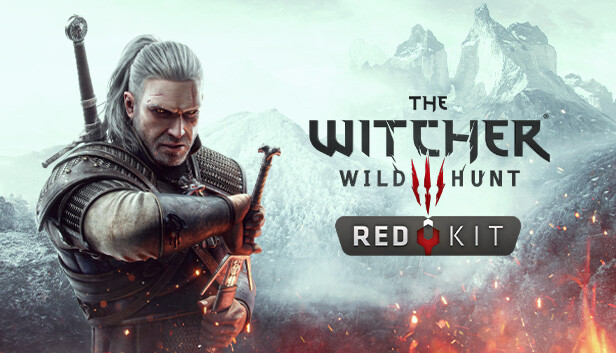

# Home

<figure><figcaption></figcaption></figure>

\
The Witcher 3 REDkit is a comprehensive modding tool for The Witcher 3: Wild Hunt. It is based on the same set of tools that were used by the developers at CD PROJEKT RED to create the game and should allow for nearly limitless freedom in modding it. REDkit is available free of charge for all owners of The Witcher 3: Wild Hunt on PC.\
\
This repository and wiki are used for two purposes:\
1\. To centralise unofficial REDkit guides created by the community, allowing more ease of access. \
2\. To track issues with the REDkit that may be patched in the future.

## Quick Links

[REDkit Changelog](redkit-changelog.md)\
\
[Issue Tracking](issue-tracking.md)\
\
[Contributing to the wiki](contributing-to-the-wiki.md)\
\
[Guides](broken-reference)
